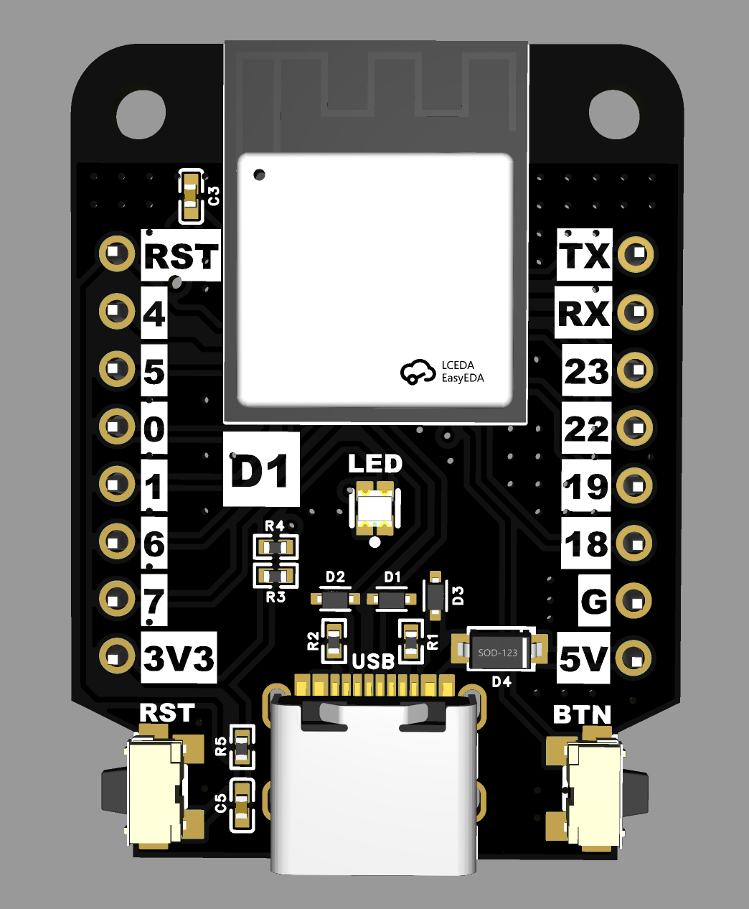
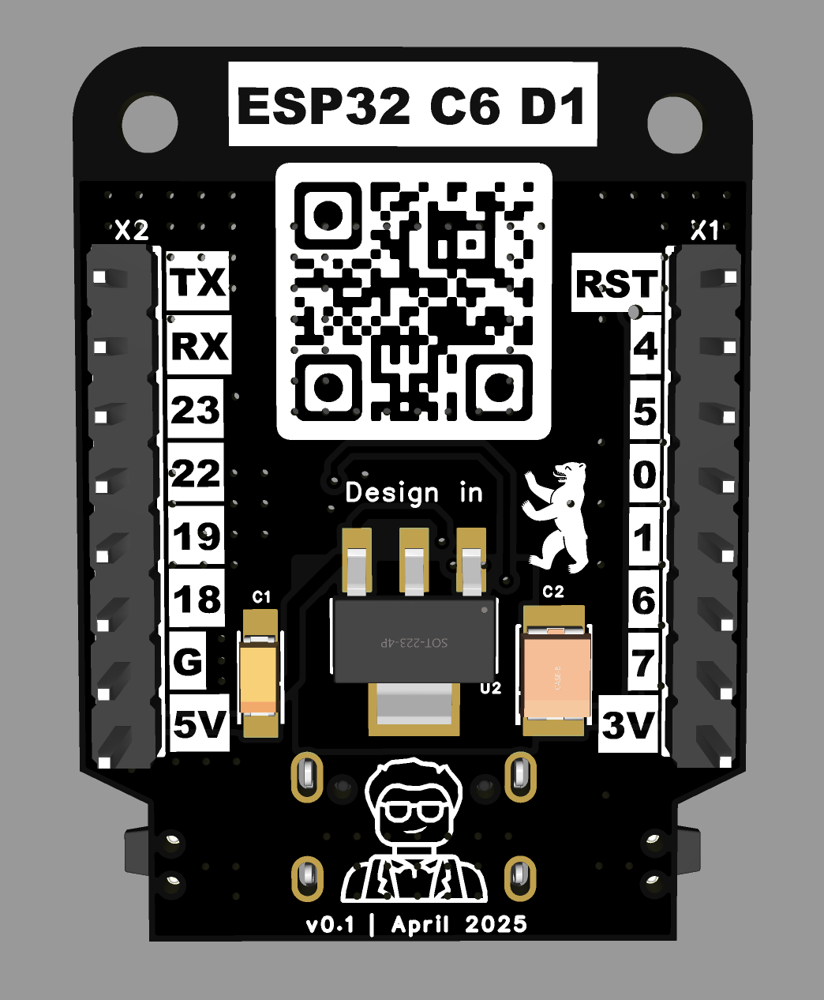
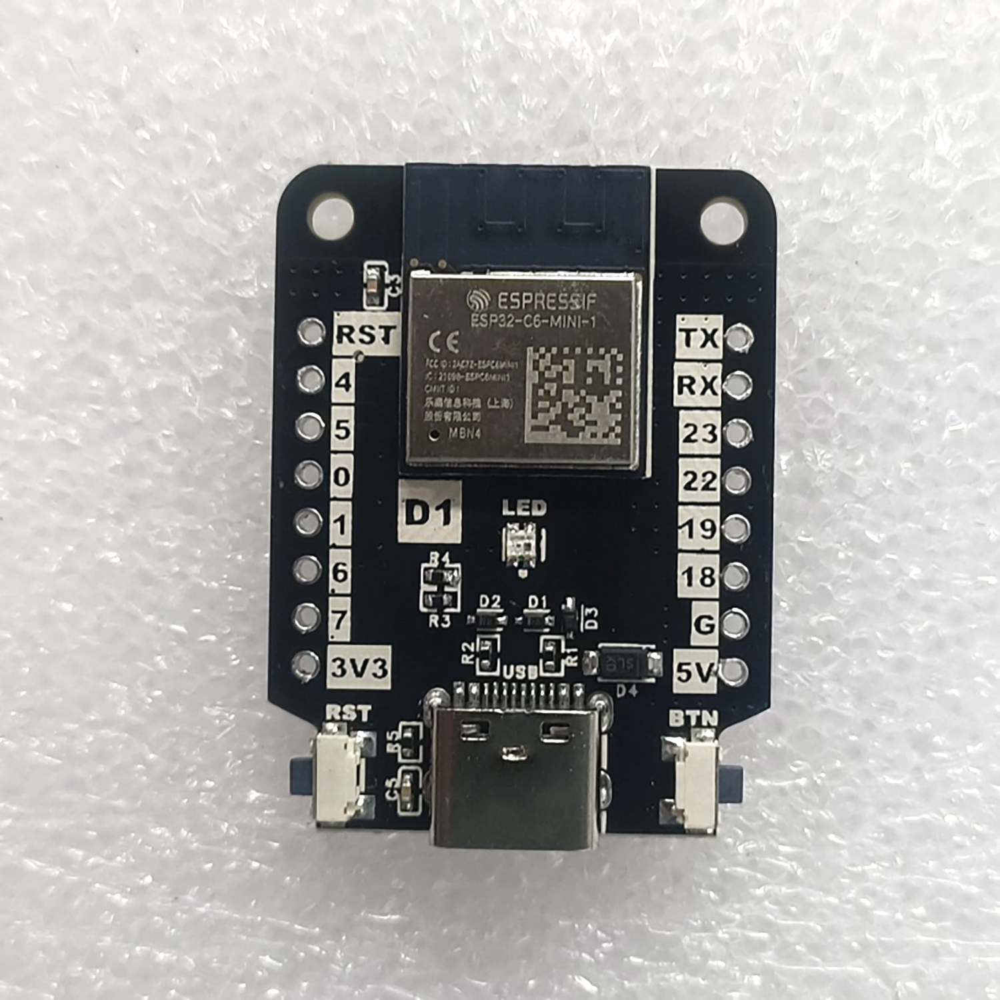
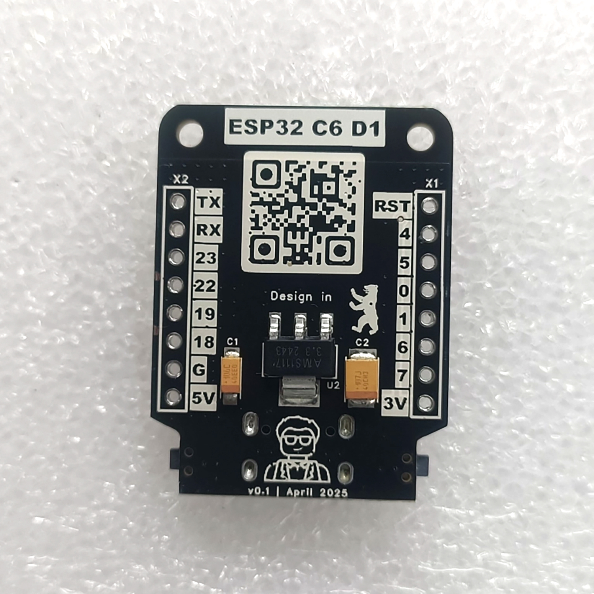

# ESP32_C6_D1

### About
Unleash the future of wireless connectivity with **ESP32 C6 D1** — a compact, feature-packed dev board crafted in the iconic Wemos D1 form factor, designed for developers craving speed, efficiency, and versatility.   
Built on Espressif’s cutting-edge ESP32-C6, this board supercharges your IoT projects.  
  
✅ Wemos D1 Form Factor – Seamless compatibility with existing shields, sensors, and accessories.  
✅ RISC-V Core – High performance (160 MHz) meets energy efficiency for battery-powered brilliance.  
✅ 10 GPIOs – SPI, I2C, UART, PWM, and ADC pins for endless hardware hacks. + UART pins  
✅ USB-C (PROG + JTAG) + Onboard WS2812 LED – Plug, play, and debug with modern convenience.  
✅ Wi-Fi 6 + Bluetooth 5 LE + 802.15.4 Zigbee/Thread  
  
Perfect for smart homes, industrial automation, or bleeding-edge prototypes. Code in Arduino, PlatformIO, or ESP-IDF—your creativity, supercharged.  
  
Build faster. Connect smarter. Future-proof your tech. 🚀  
For makers, hackers, and pros who refuse to settle.  
  
### Overview
#### Renders

#### Photos

### Schematic
[PDF](./files/Schematic.pdf)  
 

### Where to buy?
Not yet 🚀

### DIY
- [BOM csv](./files/BOM.csv) 🌍
- [Gerber zip](./files/Gerber.zip) 🗂

This work is licensed under a <a rel="license" href="http://creativecommons.org/licenses/by-nc-sa/4.0/">Creative Commons Attribution-NonCommercial-ShareAlike 4.0 International License</a>

### Like ♥️?
 

 
