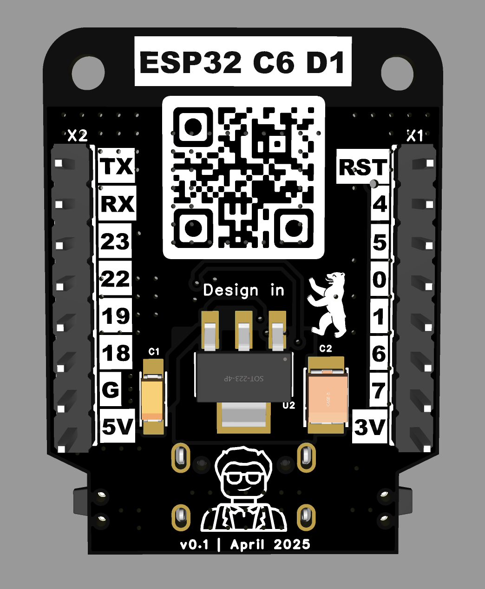
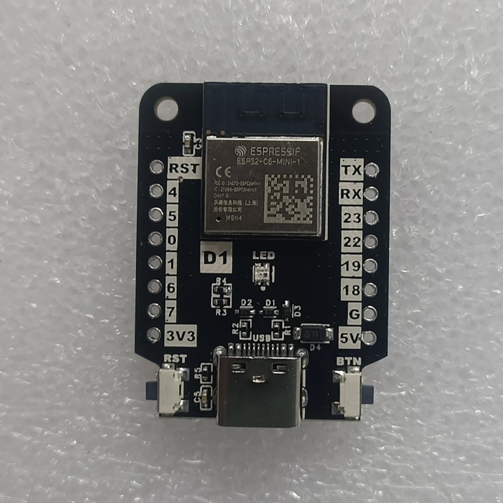
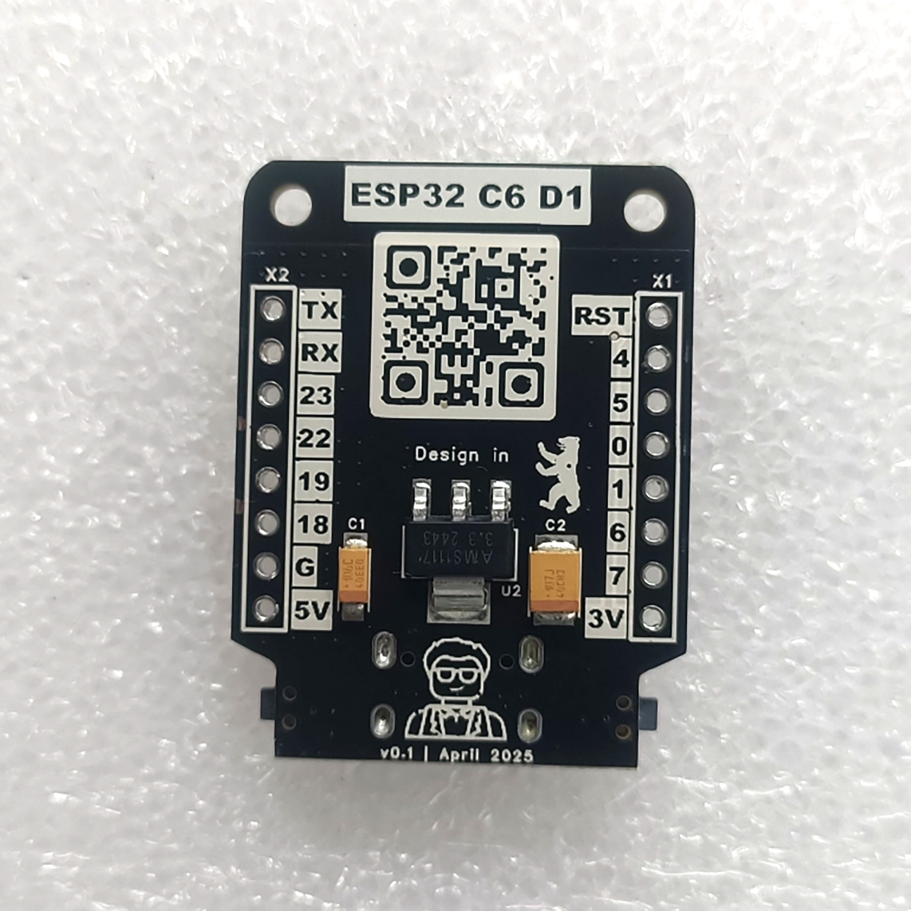
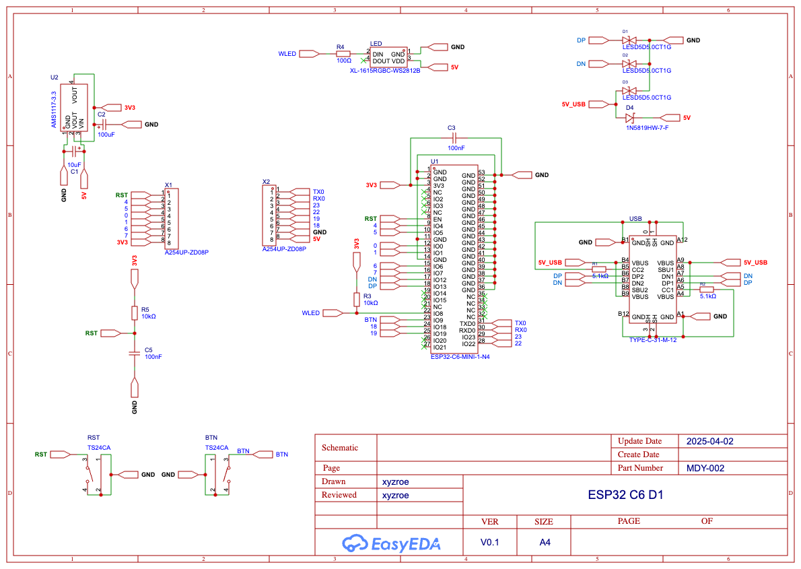

### About
Unleash the future of wireless connectivity with **ESP32 C6 D1** — a compact, feature-packed dev board crafted in the iconic Wemos D1 form factor, designed for developers craving speed, efficiency, and versatility.   
Built on Espressif’s cutting-edge ESP32-C6, this board supercharges your IoT projects.  
  
✅ Wemos D1 Form Factor – Seamless compatibility with existing shields, sensors, and accessories.  
✅ RISC-V Core – High performance (160 MHz) meets energy efficiency for battery-powered brilliance.  
✅ 10 GPIOs – SPI, I2C, UART, PWM, and ADC pins for endless hardware hacks. + UART pins  
✅ USB-C (PROG + JTAG) + Onboard WS2812 LED – Plug, play, and debug with modern convenience.  
✅ Wi-Fi 6 + Bluetooth 5 LE + 802.15.4 Zigbee/Thread  
  
Perfect for smart homes, industrial automation, or bleeding-edge prototypes. Code in Arduino, PlatformIO, or ESP-IDF—your creativity, supercharged.  
  
Build faster. Connect smarter. Future-proof your tech. 🚀  
For makers, hackers, and pros who refuse to settle.  
  
### Overview
#### Renders

#### Photos

  
  
<video src="https://private-user-images.githubusercontent.com/6440415/439916894-9b871911-9e49-4cb8-ab3b-2ddeeefc021e.mp4?jwt=eyJhbGciOiJIUzI1NiIsInR5cCI6IkpXVCJ9.eyJpc3MiOiJnaXRodWIuY29tIiwiYXVkIjoicmF3LmdpdGh1YnVzZXJjb250ZW50LmNvbSIsImtleSI6ImtleTUiLCJleHAiOjE3NDYxODk5NDgsIm5iZiI6MTc0NjE4OTY0OCwicGF0aCI6Ii82NDQwNDE1LzQzOTkxNjg5NC05Yjg3MTkxMS05ZTQ5LTRjYjgtYWIzYi0yZGRlZWVmYzAyMWUubXA0P1gtQW16LUFsZ29yaXRobT1BV1M0LUhNQUMtU0hBMjU2JlgtQW16LUNyZWRlbnRpYWw9QUtJQVZDT0RZTFNBNTNQUUs0WkElMkYyMDI1MDUwMiUyRnVzLWVhc3QtMSUyRnMzJTJGYXdzNF9yZXF1ZXN0JlgtQW16LURhdGU9MjAyNTA1MDJUMTI0MDQ4WiZYLUFtei1FeHBpcmVzPTMwMCZYLUFtei1TaWduYXR1cmU9YjViYzljN2Q5YzZmNGRiNDZmMjE0YWZkMDc0NGU3YmFiYzUwNGIwYTZkYzE3OWY1ZDM0NjEzMjQzZDQwNDRkNyZYLUFtei1TaWduZWRIZWFkZXJzPWhvc3QifQ.j-YdilJHWfRRDFUMAV46hhBD1NxavYX5OhkxAX_-pDs" data-canonical-src="https://private-user-images.githubusercontent.com/6440415/439916894-9b871911-9e49-4cb8-ab3b-2ddeeefc021e.mp4?jwt=eyJhbGciOiJIUzI1NiIsInR5cCI6IkpXVCJ9.eyJpc3MiOiJnaXRodWIuY29tIiwiYXVkIjoicmF3LmdpdGh1YnVzZXJjb250ZW50LmNvbSIsImtleSI6ImtleTUiLCJleHAiOjE3NDYxODk5NDgsIm5iZiI6MTc0NjE4OTY0OCwicGF0aCI6Ii82NDQwNDE1LzQzOTkxNjg5NC05Yjg3MTkxMS05ZTQ5LTRjYjgtYWIzYi0yZGRlZWVmYzAyMWUubXA0P1gtQW16LUFsZ29yaXRobT1BV1M0LUhNQUMtU0hBMjU2JlgtQW16LUNyZWRlbnRpYWw9QUtJQVZDT0RZTFNBNTNQUUs0WkElMkYyMDI1MDUwMiUyRnVzLWVhc3QtMSUyRnMzJTJGYXdzNF9yZXF1ZXN0JlgtQW16LURhdGU9MjAyNTA1MDJUMTI0MDQ4WiZYLUFtei1FeHBpcmVzPTMwMCZYLUFtei1TaWduYXR1cmU9YjViYzljN2Q5YzZmNGRiNDZmMjE0YWZkMDc0NGU3YmFiYzUwNGIwYTZkYzE3OWY1ZDM0NjEzMjQzZDQwNDRkNyZYLUFtei1TaWduZWRIZWFkZXJzPWhvc3QifQ.j-YdilJHWfRRDFUMAV46hhBD1NxavYX5OhkxAX_-pDs" controls="controls" muted="muted" class="d-block rounded-bottom-2 border-top width-fit" style="max-height:640px; min-height: 200px">
</video>

### Schematic
[PDF](./files/Schematic.pdf)  
 

### Where to buy?

### DIY
- [BOM csv](./files/BOM.csv) 🌍
- [Gerber zip](./files/Gerber.zip) 🗂

This work is licensed under a <a rel="license" href="http://creativecommons.org/licenses/by-nc-sa/4.0/">Creative Commons Attribution-NonCommercial-ShareAlike 4.0 International License</a>

### Like ♥️?
 

 
